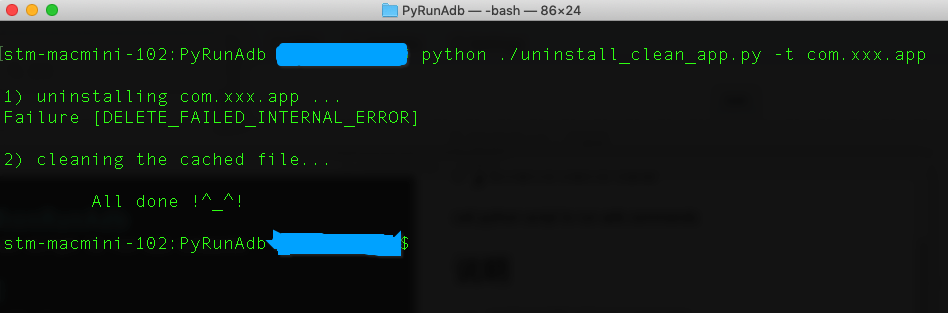
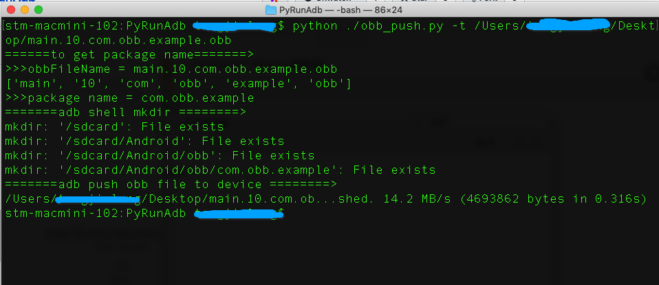

# PythonRunAdb
call python script to run adb commands

# 说明
两个脚本都是根据开发过程中的业务需求而开发，并不具备通用性。但是其核心代码都是通过python的api执行adb命令：

```
//example
cmd = 'adb shell' 
os.system(cmd)
```
* `uninstall_clean_app.py`

根据app bundle id 卸载应用，并且删除该应用在sdcard目录下生成的文件夹等。当前脚本中所删除的目录是写死的，可以根据需要自己修改。

* 使用方法
	* 下载脚本到指定目录
	* 打开terminal，执行cd命令到脚本所在目录
	* 执行python命令 ` python ./uninstall_clean_app.py -t com.xxx.app`

	
	
	
* `obb_push.py`

该脚本作用是根据传入的obb文件完整路径，解析出app bundle id,然后将obb文件push到android设备上，减少出错机会和烦人的拷贝工作，执行该脚本可有快速完成。

* 使用方法同上，最后执行命令 `python ./obb_push.py -t <obb file path>`

